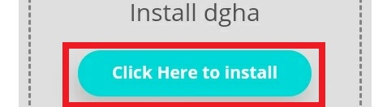
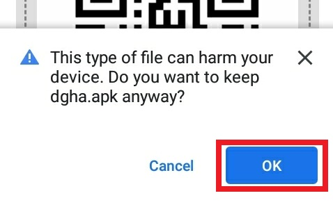

# Ruffurees - DGHA App

A flutter app that allows guide dog owners to rate places according to its accessibility for assistance dogs.

## Installation
### Android

#### 1. Download the APK

> Required to be on an android device

[Download Link](http://bit.ly/2DquBRx)

#### 2. Select "Click Here to Install"

#### 3. Select OK

#### 4. Select "Install"

#### 5. Select "Install Anyway"

## iOS

TBA

## Developers

https://github.com/josephkhaipi

https://github.com/leechuyem

https://github.com/Meandmy10

https://github.com/Thornie